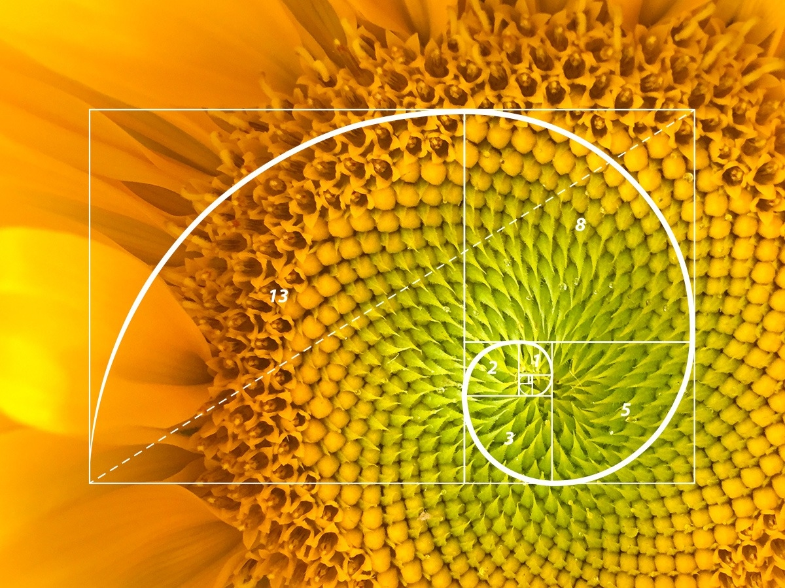
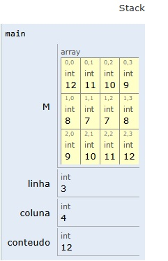
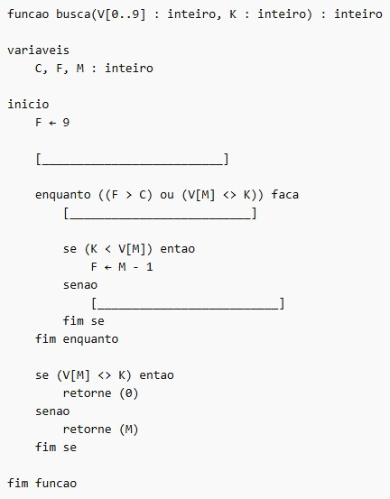

# REVISÃO TEMAS ESPECÍFICOS ADS - Virtualização, Recursividade, Busca Binária

#### 24/02/2026 {.unnumbered}

#### Professor Miguél Suares {.unnumbered}

------------------------------------------------------------------------

## Revisão do tema VIRTUALIZAÇÃO E MÁQUINAS VIRTUAIS:

+--------------------------------------------------------------------------------------------------------------------------------------------------------------------------------------------------------------------------------------------------------------------------------------------------------------------------------------------------------------------------------------------------------------------------------------------------------------------------------------------------------------------------------------------------------------------------------------------------------+
| Exercício 01 - Tomo 01 - questão 05                                                                                                                                                                                                                                                                                                                                                                                                                                                                                                                                                                    |
+========================================================================================================================================================================================================================================================================================================================================================================================================================================================================================================================================================================================================+
| O conceito de máquina virtual (MV) foi usado, na década de 1970, no sistema operacional IBM System 370. Atualmente, centros de dados (datacenters) usam MVs para migrar tarefas entre servidores conectados em rede e, assim, equilibrar carga de processamento. Além disso, plataformas atuais de desenvolvimento de software empregam MVs (Java, .NET). Uma MV pode ser construída para emular um processador ou um computador completo. Um código desenvolvido para uma máquina real pode ser executado de forma transparente em uma MV. Com relação a essas informações, assinale a opção correta. |
+--------------------------------------------------------------------------------------------------------------------------------------------------------------------------------------------------------------------------------------------------------------------------------------------------------------------------------------------------------------------------------------------------------------------------------------------------------------------------------------------------------------------------------------------------------------------------------------------------------+
| A)  O conceito de transparência mencionado indica que a MV permite que um aplicativo acesse diretamente o hardware da máquina.                                                                                                                                                                                                                                                                                                                                                                                                                                                                         |
+--------------------------------------------------------------------------------------------------------------------------------------------------------------------------------------------------------------------------------------------------------------------------------------------------------------------------------------------------------------------------------------------------------------------------------------------------------------------------------------------------------------------------------------------------------------------------------------------------------+
| B)  Uma das vantagens mais significativas de uma MV é a economia de carga de CPU e de memória RAM na execução de um aplicativo.                                                                                                                                                                                                                                                                                                                                                                                                                                                                        |
+--------------------------------------------------------------------------------------------------------------------------------------------------------------------------------------------------------------------------------------------------------------------------------------------------------------------------------------------------------------------------------------------------------------------------------------------------------------------------------------------------------------------------------------------------------------------------------------------------------+
| C)  **Uma MV oferece maior controle de segurança, uma vez que aplicativos são executados em um ambiente controlado.**                                                                                                                                                                                                                                                                                                                                                                                                                                                                                  |
+--------------------------------------------------------------------------------------------------------------------------------------------------------------------------------------------------------------------------------------------------------------------------------------------------------------------------------------------------------------------------------------------------------------------------------------------------------------------------------------------------------------------------------------------------------------------------------------------------------+
| D)  Para emular uma CPU dual-core, uma MV deve ser instalada e executada em um computador com CPU dual-core.                                                                                                                                                                                                                                                                                                                                                                                                                                                                                           |
+--------------------------------------------------------------------------------------------------------------------------------------------------------------------------------------------------------------------------------------------------------------------------------------------------------------------------------------------------------------------------------------------------------------------------------------------------------------------------------------------------------------------------------------------------------------------------------------------------------+
| E)  Como uma MV não é uma máquina real, um sistema operacional nela executado fica automaticamente imune a vírus.                                                                                                                                                                                                                                                                                                                                                                                                                                                                                      |
+--------------------------------------------------------------------------------------------------------------------------------------------------------------------------------------------------------------------------------------------------------------------------------------------------------------------------------------------------------------------------------------------------------------------------------------------------------------------------------------------------------------------------------------------------------------------------------------------------------+

### Resolução:

Máquinas Virtuais são ambientes de memória e processamento criados por um software chamado **hypervisor**:

+--------------------------------------------------------------+---------------------------------------------------------------+
|  | O que faz um hipervisor ?                                     |
|                                                              |                                                               |
|                                                              | 1.  Criar máquinas virtuais (VMs);                            |
|                                                              |                                                               |
|                                                              | 2.  Gerenciar CPU, memória, disco e rede ;                    |
|                                                              |                                                               |
|                                                              | 3.  Isolar os sistemas operacionais convidado ;               |
|                                                              |                                                               |
|                                                              | 4.  Intermediar o acesso ao hardware físico;                  |
|                                                              |                                                               |
|                                                              |     Tipos de hipervisores:                                    |
|                                                              |                                                               |
|                                                              |     Tipo 1 - Roda diretamente no Hardware;                    |
|                                                              |                                                               |
|                                                              |     Tipo 2 - Roda hospedado um sistema operacional anfitrião; |
+--------------------------------------------------------------+---------------------------------------------------------------+

### "Loteamento" de Recursos: Processador, Memória e Armazenamento

Para cada máquina virtual criada, o sistema operacional anfitrião compartilha recursos com a máquina virtual criada pelo hypervisor e o sistema operacional hospedeiro de cada máquina virtual.


### Referências:

```         
• MACHADO, F. B. Arquitetura de sistemas operacionais. Rio de Janeiro: LTC, 2013.
• TANENBAUM, A. S.; BOS, H. Sistemas operacionais modernos. São Paulo: Pearson Education do Brasil, 2016.  
• TOSCANI, S. Sistemas operacionais. São Paulo: Artmed, 2010.
```

------------------------------------------------------------------------

## Revisão do tema RECURSIVIDADE em linguagens de programação:

+-------------------------------------------------------------------------------------------------------------------------------------------------------------------------------------------------------------+
| Exercício 02 - Tomo 02 - questão 03                                                                                                                                                                         |
+=============================================================================================================================================================================================================+
|                                                                                                                                                             |
+-------------------------------------------------------------------------------------------------------------------------------------------------------------------------------------------------------------+
| Os termos da sequência de Fibonacci são definidos por:                                                                                                                                                      |
+-------------------------------------------------------------------------------------------------------------------------------------------------------------------------------------------------------------+
| ``` pseudocode                                                                                                                                                                                              |
| Fibonacci(0) = 0                                                                                                                                                                                            |
|     Fibonacci(1) = 1                                                                                                                                                                                        |
|     ...                                                                                                                                                                                                     |
|     Fibonacci(n) = Fibonacci(n-1) + Fibonacci(n-2)                                                                                                                                                          |
| ```                                                                                                                                                                                                         |
|                                                                                                                                                                                                             |
| Uma solução recursiva para o cálculo do ***i-*****ésimo termo da sequência** é dada pela função a seguir.                                                                                                   |
+-------------------------------------------------------------------------------------------------------------------------------------------------------------------------------------------------------------+
| ``` pseudocodigo                                                                                                                                                                                            |
| ALGORITMO Fibonacci                                                                                                                                                                                         |
| ENTRADA: n (Inteiro Longo)                                                                                                                                                                                  |
| SAÍDA: O n-ésimo número da sequência                                                                                                                                                                        |
|                                                                                                                                                                                                             |
| INÍCIO                                                                                                                                                                                                      |
|     FUNÇÃO fibonacci(n: Inteiro Longo) : Inteiro Longo                                                                                                                                                      |
|     INÍCIO                                                                                                                                                                                                  |
|         // Caso base: se n for 0 ou 1, retorna o próprio n                                                                                                                                                  |
|         SE (n == 0) OU (n == 1) ENTÃO                                                                                                                                                                       |
|             RETORNE n                                                                                                                                                                                       |
|         SENÃO                                                                                                                                                                                               |
|             // Passo recursivo: soma os dois termos anteriores                                                                                                                                              |
|             RETORNE fibonacci(n - 1) + fibonacci(n - 2)                                                                                                                                                     |
|         FIM_SE                                                                                                                                                                                              |
|     FIM_FUNÇÃO                                                                                                                                                                                              |
| FIM                                                                                                                                                                                                         |
| ```                                                                                                                                                                                                         |
+-------------------------------------------------------------------------------------------------------------------------------------------------------------------------------------------------------------+
| Acerca da execução recursiva dessa função, assinale a opção incorreta.                                                                                                                                      |
+-------------------------------------------------------------------------------------------------------------------------------------------------------------------------------------------------------------+
| A)  À medida que o valor de n cresce, há um aumento no número de chamadas recursivas.                                                                                                                       |
+-------------------------------------------------------------------------------------------------------------------------------------------------------------------------------------------------------------+
| B)  Na linha 4, a ordem de execução é calcular o valor para fibonacci(n-1) e somente depois calcular o valor para fibonacci(n-2).                                                                           |
+-------------------------------------------------------------------------------------------------------------------------------------------------------------------------------------------------------------+
| C)  **O método recursivo é o mais eficiente para o cálculo do i-ésimo termo da sequência de Fibonacci, pois realiza duas chamadas por passo da recursão, cada uma mais simples do que a chamada original.** |
+-------------------------------------------------------------------------------------------------------------------------------------------------------------------------------------------------------------+
| D)  As condições de parada da recursão são: o valor de n é 0 ou o valor de n é 1.                                                                                                                           |
+-------------------------------------------------------------------------------------------------------------------------------------------------------------------------------------------------------------+
| E)  O uso da recursão para o problema da série de Fibonacci não é indicado, pois ele gera rapidamente uma explosão de chamadas do método.                                                                   |
+-------------------------------------------------------------------------------------------------------------------------------------------------------------------------------------------------------------+

### RESOLUÇÃO:

A sequência de Fibbonacci

**0, 1, 1, 2, 3, 5, 8, 13, 21, 34, 55, 89...**

|  |  |  |  |  |  |  |  |  |  |  |  |  |
|------|------|------|------|------|------|------|------|------|------|------|------|------|
| **Ordem** | **zero** | **1º** | **2º** | **3º** | **4º** | **5º** | **6º** | **7º** | **8º** | **9º** | **10º** | **11º** |
| **Valor** | 0 | 1 | 1 | 2 | 3 | 5 | 8 | 13 | 21 | 34 | 55 | 89 |

$$
\begin{aligned}[l]
F(0) &= 0 \\
F(1) &= 1 \\
F(2) &= F(1) + F(0) \implies (1 + 0) = 1 \\
F(3) &= F(2) + F(1) \implies (1 + 1) = 2 \\
F(4) &= F(3) + F(2) \implies (2 + 1) = 3 \\
F(5) &= F(4) + F(3) \implies (3 + 2) = 5 \\
F(6) &= F(5) + F(4) \implies (5 + 3) = 8 \\
F(7) &= F(6) + F(5) \implies (8 + 5) = 13 \\
F(8) &= F(7) + F(6) \implies (13 + 8) = 21 \\
F(9) &= F(8) + F(7) \implies (21 + 13) = 34 \\
F(10) &= F(9) + F(8) \implies (34 + 21) = 55
\end{aligned}
$$

### Referências:

```         
• BHARGAVA, A. Y. Entendendo algoritmos. São Paulo: Novatec, 2017.
• CORMEN, T. H. Algoritmos – teoria e prática. São Paulo: LTC, 2012.
• DASGUPTA, S.; PAPADIMITRIOU, C. H.; VAZIRANI, U. Algoritmos. São Paulo: McGraw-Hill, 2006.
• MEDINA, M.; FERTIG, C. Algoritmos e programação – teoria e prática. São Paulo: Novatec, 2005. 
```

------------------------------------------------------------------------

## Revisão do tema ALGORITMOS - EXECUÇÃO

+---------------------------------------------------------------------------------------+---------+
| **Exercício 03 - Tomo 03 - Questão 06**                                               |         |
+---------------------------------------------------------------------------------------+---------+
| Leia o algoritmo a seguir.                                                            |         |
+---------------------------------------------------------------------------------------+---------+
| ``` pseudocodigo                                                                      |         |
| Algoritmo MatrizENADE2008                                                             |         |
|                                                                                       |         |
| variaveis                                                                             |         |
|     M[0..2][0..3], I, J, C : inteiro                                                  |         |
|                                                                                       |         |
| inicio                                                                                |         |
|     C ← 0                                                                             |         |
|                                                                                       |         |
|     // Preenchimento da matriz                                                        |         |
|     para I ← 0 ate 2 passo 1 faca                                                     |         |
|         para J ← 0 ate 3 passo 1 faca                                                 |         |
|             C ← C + 1                                                                 |         |
|             M[I][J] ← C                                                               |         |
|         fim para                                                                      |         |
|     fim para                                                                          |         |
|                                                                                       |         |
|     // Reorganização (espelhamento)                                                   |         |
|     para I ← 0 ate 2 passo 1 faca                                                     |         |
|         para J ← 0 ate 3 passo 1 faca                                                 |         |
|             C ← M[2 - I][3 - J]                                                       |         |
|             M[I][J] ← C                                                               |         |
|         fim para                                                                      |         |
|     fim para                                                                          |         |
|                                                                                       |         |
| fim algoritmo                                                                         |         |
| ```                                                                                   |         |
+---------------------------------------------------------------------------------------+---------+
| Considerando a execução do algoritmo apresentada acima, faça o que se pede a seguir.  |         |
|                                                                                       |         |
| A) Apresente os dados da matriz M ao término da execução da linha 10.                 |         |
|                                                                                       |         |
| B) Apresente os dados da matriz M ao término da execução da linha 15.                 |         |
+---------------------------------------------------------------------------------------+---------+

### RESOLUÇÃO:

$$
\begin{array}{cc}
 & \begin{matrix} \color{blue}{ 0} & \color{blue}{ 1} & \color{blue}{ 2} & \color{blue}{ 3} \end{matrix} \\
\begin{matrix} \color{red}{\scriptstyle 0} \\ \color{red}{\scriptstyle 1} \\ \color{red}{\scriptstyle 2} \end{matrix} & \begin{bmatrix}
\text{_} & \text{_} & \text{_} & \text{_} \\
\text{_} & \text{_} & \text{_} & \text{_} \\
\text{_} & \text{_} & \text{_} & \text{_}
\end{bmatrix}
\end{array}
$$

$$
\begin{array}{cc}
 & \begin{matrix} \color{blue}{ 0} & \color{blue}{ 1} & \color{blue}{ 2} & \color{blue}{ 3} \end{matrix} \\
\begin{matrix} \color{red}{\scriptstyle 0} \\ \color{red}{\scriptstyle 1} \\ \color{red}{\scriptstyle 2} \end{matrix} & \begin{bmatrix}
\text{1} & \text{2} & \text{...} & \text{...} \\
\text{_} & \text{_} & \text{_} & \text{_} \\
\text{_} & \text{_} & \text{_} & \text{_}
\end{bmatrix}
\end{array}
$$



### Referências:

------------------------------------------------------------------------

## Revisão do tema ALGORITMOS - BUSCA BINÁRIA - "**DIVIDIR PARA CONQUISTAR**".

+--------------------------------------------------------------------------------------------------------------------------------------------------------------------------------------------------------------------------------------------------------------------------------------------------------------------------------------------------------------------------------------------------------------------------------------------------------------------------------------------------------------------------------------------------------------------------------------------------------------------------------------+
| **Exercício 04 - Tomo 03 - Questão 07**                                                                                                                                                                                                                                                                                                                                                                                                                                                                                                                                                                                              |
+--------------------------------------------------------------------------------------------------------------------------------------------------------------------------------------------------------------------------------------------------------------------------------------------------------------------------------------------------------------------------------------------------------------------------------------------------------------------------------------------------------------------------------------------------------------------------------------------------------------------------------------+
| Leia o algoritmo a seguir.                                                                                                                                                                                                                                                                                                                                                                                                                                                                                                                                                                                                           |
+--------------------------------------------------------------------------------------------------------------------------------------------------------------------------------------------------------------------------------------------------------------------------------------------------------------------------------------------------------------------------------------------------------------------------------------------------------------------------------------------------------------------------------------------------------------------------------------------------------------------------------------+
|                                                                                                                                                                                                                                                                                                                                                                                                                                                                                                                                                                                     |
+--------------------------------------------------------------------------------------------------------------------------------------------------------------------------------------------------------------------------------------------------------------------------------------------------------------------------------------------------------------------------------------------------------------------------------------------------------------------------------------------------------------------------------------------------------------------------------------------------------------------------------------+
| O algoritmo representado pelo pseudocódigo acima está incompleto, pois faltam 3 linhas de código. **A função busca** desse algoritmo recebe um **vetor ordenado de forma crescente** e um **valor a ser pesquisado**. A partir disso, essa função **verificará se o número armazenado no ponto mediano do vetor é o número procurado**. Se for o número procurado, **retornará o índice da posição do elemento no vetor e encerrará a busca**. Se não for, a função **segmentará o vetor em duas partes a partir do ponto mediano**, escolherá o **segmento no qual o valor procurado está inserido**, e o **processo se repetirá**. |
|                                                                                                                                                                                                                                                                                                                                                                                                                                                                                                                                                                                                                                      |
| A partir dessas informações, assinale a opção que contém os comandos que completam, respectivamente, as linhas 6, 8 e 12 do algoritmo.                                                                                                                                                                                                                                                                                                                                                                                                                                                                                               |
+--------------------------------------------------------------------------------------------------------------------------------------------------------------------------------------------------------------------------------------------------------------------------------------------------------------------------------------------------------------------------------------------------------------------------------------------------------------------------------------------------------------------------------------------------------------------------------------------------------------------------------------+
| A)                                                                                                                                                                                                                                                                                                                                                                                                                                                                                                                                                                                                                                   |
|                                                                                                                                                                                                                                                                                                                                                                                                                                                                                                                                                                                                                                      |
| ```                                                                                                                                                                                                                                                                                                                                                                                                                                                                                                                                                                                                                                  |
| C ← 0                                                                                                                                                                                                                                                                                                                                                                                                                                                                                                                                                                                                                                |
| M ← (C + F) / 2                                                                                                                                                                                                                                                                                                                                                                                                                                                                                                                                                                                                                      |
| C ← M + 1                                                                                                                                                                                                                                                                                                                                                                                                                                                                                                                                                                                                                            |
| ```                                                                                                                                                                                                                                                                                                                                                                                                                                                                                                                                                                                                                                  |
+--------------------------------------------------------------------------------------------------------------------------------------------------------------------------------------------------------------------------------------------------------------------------------------------------------------------------------------------------------------------------------------------------------------------------------------------------------------------------------------------------------------------------------------------------------------------------------------------------------------------------------------+
| B)                                                                                                                                                                                                                                                                                                                                                                                                                                                                                                                                                                                                                                   |
|                                                                                                                                                                                                                                                                                                                                                                                                                                                                                                                                                                                                                                      |
| ```                                                                                                                                                                                                                                                                                                                                                                                                                                                                                                                                                                                                                                  |
| C ← 1                                                                                                                                                                                                                                                                                                                                                                                                                                                                                                                                                                                                                                |
| M ← (C + F) / 2                                                                                                                                                                                                                                                                                                                                                                                                                                                                                                                                                                                                                      |
| C ← M - 1                                                                                                                                                                                                                                                                                                                                                                                                                                                                                                                                                                                                                            |
| ```                                                                                                                                                                                                                                                                                                                                                                                                                                                                                                                                                                                                                                  |
+--------------------------------------------------------------------------------------------------------------------------------------------------------------------------------------------------------------------------------------------------------------------------------------------------------------------------------------------------------------------------------------------------------------------------------------------------------------------------------------------------------------------------------------------------------------------------------------------------------------------------------------+
| C)                                                                                                                                                                                                                                                                                                                                                                                                                                                                                                                                                                                                                                   |
|                                                                                                                                                                                                                                                                                                                                                                                                                                                                                                                                                                                                                                      |
| ```                                                                                                                                                                                                                                                                                                                                                                                                                                                                                                                                                                                                                                  |
| C. C ← 0                                                                                                                                                                                                                                                                                                                                                                                                                                                                                                                                                                                                                             |
| C ← M + 1                                                                                                                                                                                                                                                                                                                                                                                                                                                                                                                                                                                                                            |
| M ← (C + F) / 2                                                                                                                                                                                                                                                                                                                                                                                                                                                                                                                                                                                                                      |
| ```                                                                                                                                                                                                                                                                                                                                                                                                                                                                                                                                                                                                                                  |
+--------------------------------------------------------------------------------------------------------------------------------------------------------------------------------------------------------------------------------------------------------------------------------------------------------------------------------------------------------------------------------------------------------------------------------------------------------------------------------------------------------------------------------------------------------------------------------------------------------------------------------------+
| D)                                                                                                                                                                                                                                                                                                                                                                                                                                                                                                                                                                                                                                   |
|                                                                                                                                                                                                                                                                                                                                                                                                                                                                                                                                                                                                                                      |
| ```                                                                                                                                                                                                                                                                                                                                                                                                                                                                                                                                                                                                                                  |
| C ← 1                                                                                                                                                                                                                                                                                                                                                                                                                                                                                                                                                                                                                                |
| C ← M + 1                                                                                                                                                                                                                                                                                                                                                                                                                                                                                                                                                                                                                            |
| M ← (C + F) / 2                                                                                                                                                                                                                                                                                                                                                                                                                                                                                                                                                                                                                      |
| ```                                                                                                                                                                                                                                                                                                                                                                                                                                                                                                                                                                                                                                  |
+--------------------------------------------------------------------------------------------------------------------------------------------------------------------------------------------------------------------------------------------------------------------------------------------------------------------------------------------------------------------------------------------------------------------------------------------------------------------------------------------------------------------------------------------------------------------------------------------------------------------------------------+
| E)                                                                                                                                                                                                                                                                                                                                                                                                                                                                                                                                                                                                                                   |
|                                                                                                                                                                                                                                                                                                                                                                                                                                                                                                                                                                                                                                      |
| ```                                                                                                                                                                                                                                                                                                                                                                                                                                                                                                                                                                                                                                  |
| C ← 1                                                                                                                                                                                                                                                                                                                                                                                                                                                                                                                                                                                                                                |
| M ← (C + F) / 2                                                                                                                                                                                                                                                                                                                                                                                                                                                                                                                                                                                                                      |
| C ← M + 1                                                                                                                                                                                                                                                                                                                                                                                                                                                                                                                                                                                                                            |
| ```                                                                                                                                                                                                                                                                                                                                                                                                                                                                                                                                                                                                                                  |
+--------------------------------------------------------------------------------------------------------------------------------------------------------------------------------------------------------------------------------------------------------------------------------------------------------------------------------------------------------------------------------------------------------------------------------------------------------------------------------------------------------------------------------------------------------------------------------------------------------------------------------------+

### RESOLUÇÃO:

O vetor é definido como **`V[0..9]`**.

Como a variável **`F`** (Fim) foi inicializada com **`9`**, a variável **`C`** (Começo/Início) deve ser inicializada com o ***primeiro índice do vetor***, que é **0**.

``` pseudocode

Comando: C ← 0
```

Dentro do laço **`enquanto`**, a primeira ação necessária para **verificar o elemento central** é **calcular a média** entre o **início** e o **fim** do segmento atual.

``` pseudocode
M ← (C + F) / 2
```

O bloco **`se ( K < V[M] )`** trata o caso onde o **valor procurado** é **menor** que o **centro** (ajustando o fim **`F`**). O **`senao`** (linha 12) trata o caso onde o **valor procurado** é **maior** que o **centro**. Para isso, devemos "**trazer**" o **início do vetor** para **logo após** o **ponto médio atual**.

``` pseudocode
C ← M + 1
```

Portanto:

``` pseudocode
C ← 0

M ← (C + F) / 2

C ← M + 1
```

**Letra "A"**

### Referências:

------------------------------------------------------------------------

## 

------------------------------------------------------------------------

## Revisão do tema RECURSIVIDADE em linguagens de programação:

+----------------------------------------------------------------------------------------------------------------------------------------------------------------------------------------------------+
| **Exercício 04 - Tomo 06 - Questão 03**                                                                                                                                                            |
+----------------------------------------------------------------------------------------------------------------------------------------------------------------------------------------------------+
| Leia o texto a seguir.                                                                                                                                                                             |
|                                                                                                                                                                                                    |
| *Uma função é denominada recursiva quando ela é chamada novamente dentro de seu corpo. Implementações recursivas tendem a ser menos eficientes, porém facilitam a codificação e seu entendimento.* |
+----------------------------------------------------------------------------------------------------------------------------------------------------------------------------------------------------+
| ``` c                                                                                                                                                                                              |
| int f(int v[], int n)                                                                                                                                                                              |
| {                                                                                                                                                                                                  |
|     if (n == 0)                                                                                                                                                                                    |
|     {                                                                                                                                                                                              |
|         return 0;                                                                                                                                                                                  |
|     }                                                                                                                                                                                              |
|     else                                                                                                                                                                                           |
|     {                                                                                                                                                                                              |
|         int s;                                                                                                                                                                                     |
|                                                                                                                                                                                                    |
|         s = f(v, n - 1);                                                                                                                                                                           |
|                                                                                                                                                                                                    |
|         if (v[n - 1] > 0)                                                                                                                                                                          |
|         {                                                                                                                                                                                          |
|             s = s + v[n - 1];                                                                                                                                                                      |
|         }                                                                                                                                                                                          |
|                                                                                                                                                                                                    |
|         return s;                                                                                                                                                                                  |
|     }                                                                                                                                                                                              |
| }                                                                                                                                                                                                  |
| ```                                                                                                                                                                                                |
+----------------------------------------------------------------------------------------------------------------------------------------------------------------------------------------------------+
| Suponha que a função f() é acionada com os seguintes parâmetros de entrada:                                                                                                                        |
+----------------------------------------------------------------------------------------------------------------------------------------------------------------------------------------------------+
| f( {2, -4, 7, 0, -1, 4}, 6);                                                                                                                                                                       |
+----------------------------------------------------------------------------------------------------------------------------------------------------------------------------------------------------+
| Nesse caso, o valor de retorno da função f( ) será:                                                                                                                                                |
+----------------------------------------------------------------------------------------------------------------------------------------------------------------------------------------------------+
| A)  ) 8                                                                                                                                                                                            |
+----------------------------------------------------------------------------------------------------------------------------------------------------------------------------------------------------+
| B)  ) 10                                                                                                                                                                                           |
+----------------------------------------------------------------------------------------------------------------------------------------------------------------------------------------------------+
| C)  ) **13**                                                                                                                                                                                       |
+----------------------------------------------------------------------------------------------------------------------------------------------------------------------------------------------------+
| D)  ) 15                                                                                                                                                                                           |
+----------------------------------------------------------------------------------------------------------------------------------------------------------------------------------------------------+
| E)  ) 18                                                                                                                                                                                           |
+----------------------------------------------------------------------------------------------------------------------------------------------------------------------------------------------------+

### RESOLUÇÃO:

Montando a função dentro de um programa C :

``` c
#include <stdio.h>

int f(int v[], int n)
{
    if (n == 0)
    {
        return 0;
    }
    else
    {
        int s;

        s = f(v, n - 1);

        if (v[n - 1] > 0)
        {
            s = s + v[n - 1];
        }

        return s;
    }
}

int main()
{
    int v[] = {2, -4, 7, 0, -1, 4};
    int n = sizeof(v) / sizeof(v[0]);

    int resultado = f(v, n);

    printf("Soma dos positivos = %d\n", resultado);

    return 0;
}
```

#### Melhorando o nome das variáveis para deixar mais didático:

``` c
#include <stdio.h>

int f(int vetor[], int contador)  // <== Função do exercício
{
    if (contador == 0)
    {
        return 0;
    }
    else
    {
        int resposta;

        resposta = f(vetor, contador - 1); // <== Função do exercício

        if (vetor[contador - 1] > 0)
        {
            resposta = resposta + vetor[contador - 1];
        }

        return resposta;
    }
}

int main()
{
    int vetor[] = {2, -4, 7, 0, -1, 4};
    
    // descobre o tamanho do contador pelo tamanho do vetor
    int contador = sizeof(vetor) / sizeof(vetor[0]);

    int resultado = f(vetor, contador);

    printf("Soma dos positivos = %d\contador", resultado);

    return 0;
}
```

Uma função recursiva **chama a sí mesma**. Ao fazer isso, em C/C++, ela **cria na pilha** (parte "organizada" da memória) **várias cópias de espaço de memória dela mesma** para **computar o cálculo em seguida**. Cada cópia existente guarda um "**momento**" (estado) **de desenvolvimento do cálculo do algoritmo da função**.

Ao final dessa **expansão de sí mesma**, a função recursiva **"revisita" toda a memória executando o cálculo**.

Cada **replicação de memória na pilha que computa o cálculo tem seu espaço de memória liberado assim que o cálculo é computado**.

A pilha (stack) é uma beleza !!

No final, o **resultado é entregue (retornado) pela função**.

Demonstração:

Rodar o código no PyTutor:

<https://pythontutor.com/visualize.html#mode=edit>

### Referências:

------------------------------------------------------------------------

```{r 01-impressao-01, eval=FALSE, include=FALSE}
rmarkdown::render("01-revisao-01-2026-02-24.Rmd", output_dir="docs", output_file ="temporario.html" , output_format = "html_document") ; utils::browseURL("docs/temporario.html")
```

```{r 01-impressao-02, eval=FALSE, include=FALSE}
rmarkdown::render("01-revisao-01-2026-02-24.Rmd", output_dir="docs", output_file ="temporario.docx" , output_format = "word_document") ; utils::browseURL("docs/temporario.docx")
```
