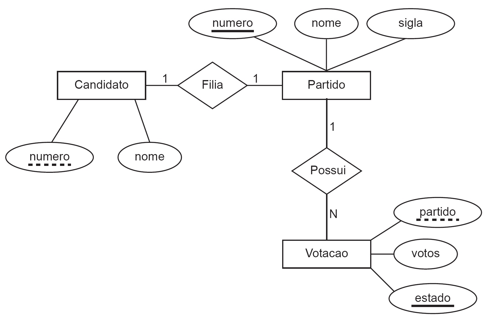

# REVISÃO TEMAS ESPECÍFICOS ADS: BANCO DE DADOS

#### 03/03/2026 {.unnumbered}

#### Professor Miguél Suares {.unnumbered}

------------------------------------------------------------------------

## Questão 3



Um cliente solicitou a uma empresa a criação de um banco de dados para armazenar o resultado de uma eleição presidencial, com dados sobre os partidos políticos, os candidatos e a votação obtida por cada candidato em cada unidade da federação.

As tabelas a seguir contêm os dados registrados a partir do resultado dessa eleição.

### 🧾 Tabela: Partido

| Número | Nome      | Sigla |
|--------|-----------|-------|
| 91     | Partido 1 | P1    |
| 92     | Partido 2 | P2    |
| 93     | Partido 3 | P3    |
| 94     | Partido 4 | P4    |
| 95     | Partido 5 | P5    |

------------------------------------------------------------------------

### 🧾 Tabela: Candidato

| Número | Nome        |
|--------|-------------|
| 91     | Candidato 1 |
| 92     | Candidato 2 |
| 93     | Candidato 3 |
| 94     | Candidato 4 |
| 95     | Candidato 5 |

------------------------------------------------------------------------

### 🧾 Tabela: Votação

| Partido | Votos   | Estado |
|---------|---------|--------|
| 91      | 12345   | AC     |
| 91      | 98323   | PE     |
| 91      | 1726453 | SP     |
| 92      | 98463   | AC     |
| 92      | 192837  | PE     |
| 92      | 4283747 | SP     |
| 93      | 16253   | AC     |
| 93      | 293845  | PE     |
| 93      | 6253745 | SP     |
| 94      | 98372   | AC     |
| 94      | 598333  | PE     |
| 94      | 8271347 | SP     |
| 95      | 46837   | AC     |
| 95      | 327264  | PE     |
| 95      | 5938374 | SP     |

------------------------------------------------------------------------

### PERGUNTA-SE

Com base nas informações e na situação apresentada, qual o comando SQL que seleciona corretamente os nomes dos candidatos, seus partidos e o total de votos de cada partido nessa eleição?

### Alternativas

A.  

``` sql
SELECT c.nome, p.nome, SUM(v.votos)
FROM Partido p, Candidato c, Votacao v
WHERE c.numero = p.numero AND v.partido = c.numero;
```

B.  

``` sql
SELECT c.nome, p.nome, COUNT(v.votos)
FROM Partido p, Candidato c, Votacao v
WHERE c.numero = p.numero AND v.partido = c.numero
GROUP BY c.nome, p.nome;
```

C.  

``` sql
SELECT c.nome, p.nome, SUM(v.votos)
FROM Partido p, Candidato c, Votacao v
WHERE c.numero = p.numero AND v.partido = c.numero
GROUP BY c.nome, p.nome;
```

D.  

``` sql
SELECT c.nome, p.nome, v.votos
FROM Partido p, Candidato c, Votacao v
WHERE c.numero = p.numero AND v.partido = c.numero
GROUP BY c.nome, p.nome, SUM(v.votos);
```

E.  

``` sql
SELECT c.nome, p.nome, COUNT(v.votos)
FROM Partido p, Candidato c, Votacao v
WHERE c.numero = p.numero AND v.partido = c.numero
GROUP BY c.nome, p.nome, v.votos;
```

------------------------------------------------------------------------

## Questão 4

Leia o texto a seguir:

> **JOÃO GRILO:** - I*sso é coisa de seca. Acaba nisso, essa fome: ninguém pode ter menino e haja cavalo no mundo. A comida é mais barata e é coisa que se pode vender. Mas seu cavalo, como foi?*
>
> **CHICÓ:** - *Foi uma velha que me vendeu barato, porque ia se mudar, mas recomendou todo cuidado, porque o cavalo era bento. E só podia ser mesmo, porque cavalo bom como aquele eu nunca tinha visto.*

(SUASSUNA, A. *Auto da compadecida*, 2000)

------------------------------------------------------------------------

### FAÇA UM DIAGRAMA ENTIDADE-RELACIONAMENTO BASEADO NESTAS INFORMAÇÕES E RESPONDA

A seguir apresenta-se um modelo de dados elaborado a partir do diálogo entre Chicó e João Grilo.

Com base no diálogo e no diagrama apresentados, avalie as afirmativas:

### Afirmativas

- I. O Chicó e a velha poderão ser cadastrados na entidade pessoa.

- II. O Chicó e a velha poderão ter mais que um cavalo cadastrado.

- III. O atributo rg da entidade pessoa pode ter a função de chave primária nessa entidade.

- IV. O cavalo deverá ter no mínimo uma pessoa e uma pessoa poderá ser cadastrada sem a necessidade de ter um cavalo.

------------------------------------------------------------------------

### Alternativas

A. I e III.

B. I e IV.

C. II e III.

D. I, II e IV.

E. II, III e IV.

------------------------------------------------------------------------

## Respostas:

| Questão | Resposta |
|---------|----------|
| 3       | **C**    |
| 4       | **B**    |
