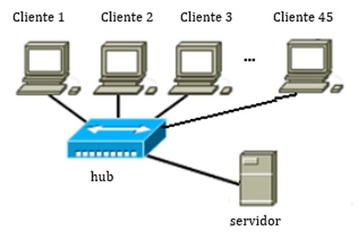
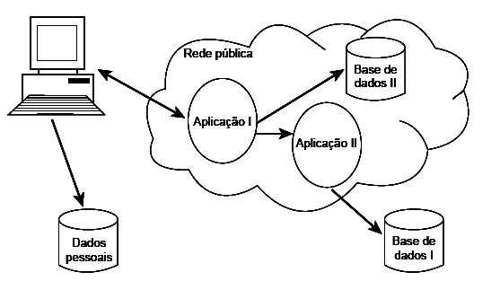

# REVISÃO TEMAS ESPECÍFICOS ADS: REDES DE COMPUTADORES

#### 10/03/2026 {.unnumbered}

#### Professor Miguél Suares {.unnumbered}

## Questão 3.3

As comunicações de um software cliente com o respectivo servidor instalado em um
equipamento em uma LAN (local area network) apresentam lentidão. Após várias 
reclamações dos usuários, o responsável pelo software e o gerente de redes foram
convocados para analisar o problema. A partir de uma análise da topologia da 
rede, foi identificado que o departamento possuía 45 microcomputadores clientes 
na mesma LAN, interligados ao servidor por meio de um único **hub**.



| Concluiu-se que o problema de lentidão estava relacionado ao elevado número de colisões na LAN. A solução correta para esse problema hipotético é a substituição do hub por: |
|------------------------------------------------------------------------|
| (A) Outros 4 hubs interligados contendo, cada um, menos portas de conexão, o que resultaria na diminuição do volume de colisões na LAN e aumentaria o desempenho da rede. |
| (B) Um switch, que permitiria a diminuição do volume de colisões e uma melhoria no desempenho da rede. |
| (C) Um switch, que traria benefícios relacionados ao desempenho da rede, uma vez que o número de colisões permaneceria inalterado. |
| (D) Um switch, que diminuiria o desempenho da rede, uma vez que aumentaria o volume de colisões. |
| (E) Um switch, que aumentaria o volume de colisões e melhoraria o desempenho da rede. |

## Questão 6.1

Considere o arranjo computacional apresentado a seguir.




| A característica fundamental esperada para tais sistemas de modo a ter o menor impacto sobre a experiência do usuário final é: |
|--------------------------------------------------------------------------------------------------------------------------------|
| (A) A transparência entre as entidades do sistema.                                                                             |
| (B) A linguagem de programação orientada a eventos.                                                                            |
| (C) A hardware com elevada taxa de processamento de dados.                                                                     |
| (D) A base de dados deve estar localizada no mesmo espaço fixo.                                                                |
| (E) A independência quanto à disponibilidade de conexão à rede de comunicação de dados.                                        |


## Questão 6.9

Leia o texto a seguir.

O serviço DNS (Domain Name System) traduz nomes alfanuméricos de hosts em endereços numéricos, de acordo com o protocolo IP (Internet Protocol).
Essa ação é comumente chamada de resolução de endereço.
Considere um conjunto de computadores conectados em uma rede local, os quais têm à sua disposição um servidor DNS capaz de resolver endereços, sejam eles internos ou externos.

Nesse contexto, avalie as afirmativas a seguir:

I. O servidor DNS também executa funções de cliente DNS quando não é autoritativo para determinado endereço.

II. A adoção do IPv6 dispensará serviços de DNS, pois suas funções serão incorporadas pelo próprio protocolo IP.

III. O cache DNS permite que determinada requisição do cliente DNS possa ser resolvida sem que seja necessário recorrer a outro serviço DNS.

IV. O protocolo DNS depende de um banco de dados distribuído.


| É correto apenas o que se afirma em: |
|--------------------------------------|
| (A) I e II.                          |
| (B) I e III.                         |
| (C) II e IV.                         |
| (D) I, III e IV.                     |
| (E) II, III e IV.                    |


### Resposta

### Respostas

3.3 **Alternativa correta: (B)** 6.1 **Alternativa correta: (A)** 6.9 **Alternativa correta: (D)**

### Comentário

O uso de **switches** reduz colisões porque permite comunicação ponto a ponto entre origem e destino, diferentemente do **hub**, que transmite dados para todos os dispositivos (broadcast), aumentando as colisões.

```{r 03-impressao-01-html, eval=FALSE, include=FALSE}
rmarkdown::render("03-revisao-03-2026-03-10.Rmd", output_dir="docs", output_file ="temporario.html" , output_format = "html_document") ; utils::browseURL("docs/temporario.html")
```

```{r 03-impressao-02-docx, eval=FALSE, include=FALSE}
rmarkdown::render("03-revisao-03-2026-03-10.Rmd", output_dir="docs", output_file ="temporario.docx" , output_format = "word_document") ; utils::browseURL("docs/temporario.docx")
```
