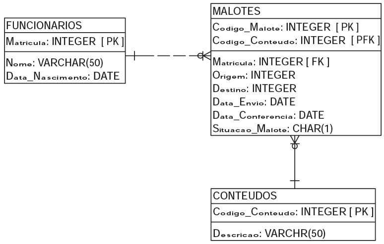
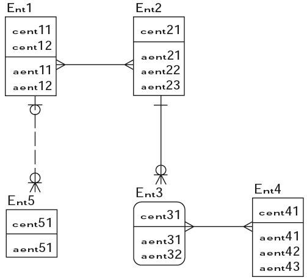

# REVISÃO TEMAS ESPECÍFICOS ADS: BANCO DE DADOS

#### 05/05/2026 {.unnumbered}

#### Professor Miguél Suares {.unnumbered}

## Questão 3.1

Uma livraria usa um sistema informatizado para realizar vendas pela Internet.
Optou-se por um sistema gerenciador de banco de dados, no qual aplicaram-se regras de corretude e integridade.
Cada cliente se cadastra, faz login no sistema e escolhe títulos, que são colocados em um carrinho de compras até a confirmação do pedido.

| Cliente  | Livro                |
|:--------:|----------------------|
|  Alice   | Estatística Básica   |
|  Alice   | História Geral       |
| Benjamin | Cálculo I            |
| Benjamin | Estatística Básica   |
| Benjamin | Inglês Intermediário |

A livraria possui apenas um exemplar do livro *Estatística básica*.
Dois clientes selecionam esse livro.
O computador de um deles sofre uma pane antes da confirmação do pedido, e o sistema é reiniciado.
Ao retornar, o carrinho do cliente permanece intacto.

Com relação a essa situação, julgue os itens seguintes:

|  |
|------------------------------------------------------------------------|
| I - A consistência do banco de dados foi violada temporariamente. |
| II - O sistema não emprega atomicidade. |
| III - Todas as transações devem ser fechadas após a recuperação do sistema. |

Assinale a opção correta:

|                               |
|-------------------------------|
| (A) Apenas um item está certo |
| (B) Apenas I e II             |
| (C) Apenas I e III            |
| (D) Apenas II e III           |
| (E) Nenhum item está certo    |

## Questão 4.6

Pedro foi contratado como desenvolvedor de software de uma empresa.
Em seu primeiro dia de trabalho ele se deparou com o DER (Diagrama Entidade-Relacionamento), que representa os dados de um sistema de controle de malotes.
Foi solicitado a Pedro relatório para o sistema contendo os seguintes dados: o nome de todos os funcionários que enviaram os malotes, o código dos malotes enviados, a descrição de seus conteúdos e a situação dos malotes.
Para a geração do relatório, Pedro tem que fazer uma consulta utilizando o comando SELECT da linguagem SQL.



| Conhecidos o modelo conceitual de dados e os dados necessários para a tarefa de Pedro, o comando SELECT que ele deve executar para realizar a consulta e produzir o relatório corretamente é: |
|----|
| A) SELECT NOME,CODIGO_MALOTE,DESCRICAO,SITUACAO_MALOTE FROM MALOTES INNER JOIN CONTEUDOS ON (CODIGO_CONTEUDO = CODIGO_CONTEUDO) INNER JOIN FUNCIONARIOS ON (MATRICULA = MATRICULA); |
| B) SELECT NOME, CODIGO_MALOTE, DESCRICAO, SITUACAO_MALOTE FROM MALOTES, CONTEUDOS, FUNCIONARIOS WHERE (CODIGO_CONTEUDO = CODIGO_CONTEUDO) AND (MATRICULA = MATRICULA); |
| C) SELECT NOME,CODIGO_MALOTE,DESCRICAO,SITUACAO_MALOTE FROM MALOTES INNER JOIN CONTEUDOS INNER JOIN FUNCIONARIOS ON(MALOTES.CODIGO_CONTEUDO = CONTEUDOS.CODIGO_CONTEUDO) ON(MALOTES.MATRICULA = FUNCIONARIOS.MATRICULA); |
| D) SELECT NOME, CODIGO_MALOTE, DESCRICAO, SITUACAO_MALOTE FROM MALOTES INNER JOIN CONTEUDOS ON (MALOTES.CODIGO_CONTEUDO = CONTEUDOS.CODIGO_CONTEUDO) INNER JOIN FUNCIONARIOS ON(MALOTES.MATRICULA = FUNCIONARIOS.MATRICULA); |
| E) SELECT NOME, CODIGO_MALOTE, DESCRICAO, SITUACAO_MALOTE FROM MALOTES, CONTEUDOS, FUNCIONARIOS INNER JOIN WHERE (MALOTES.CODIGO_CONTEUDO = CONTEUDOS.CODIGO_CONTEUDO) AND (MALOTES.MATRICULA = FUNCIONARIOS.MATRICULA); \| |

## Questão 4.7

Considere o diagrama de entidades e relacionamentos a seguir, onde as chaves primárias de cada entidade se encontram na parte superior dos retângulos.
As entidades fortes são representadas por retângulos e as entidades fracas são representadas por retângulos com cantos arredondados.

O diagrama atende às seguintes restrições:

|  |
|------------------------------------------------------------------------|
| I - entre Ent1 e Ent2, tem-se um relacionamento de muitos para muitos; |
| II - entre as Entidades Ent2 e Ent3, tem-se um relacionamento de um para nenhum, um ou muitos; |
| III - entre Ent1 e Ent5, tem-se um relacionamento de zero ou um para zero, um ou muitos; e |
| IV - entre Ent3 e Ent4, tem-se um relacionamento de muitos para muitos. |



Aplicando a terceira forma normal ao modelo, qual será o total de colunas que deve ser criado para representar as chaves estrangeiras?

|      |
|------|
| A) 3 |
| B) 5 |
| C) 7 |
| D) 8 |
| E) 9 |

## Questão 6.7

O modelo lógico de dados fornece uma visão da maneira como os dados serão armazenados.
A figura a seguir representa o modelo lógico de um ambiente observado em um escritório contábil.

Em relação ao modelo, avalie as afirmativas.

|  |
|------------------------------------------------------------------------|
| I.     A entidade Declaração Imposto de Renda é uma entidade fraca. |
| II.   O relacionamento entre Contribuinte e Malha Fina é do tipo N:M (muitos para muitos). |
| III\. O atributo CPF da entidade Contribuinte tem a função de chave estrangeira na entidade Declaração Imposto de Renda e no relacionamento Contribuinte_MalhaFina. |
| IV.  A entidade Malha Fina não possui chave primária somente chave estrangeira. |
| V. O relacionamento Contribuinte_MalhaFina é um relacionamento ternário. |

É correto apenas o que se afirma em:

|                    |
|--------------------|
| A.    I, II e III. |
| B.    I, II e IV.  |
| C.    I, IV e V.   |
| D.   II, III e V.  |
| E.    III, IV e V. |

### Respostas

3.1 **Alternativa correta: (E)**

4.6 **Alternativa correta: (B)**

4.7 **Alternativa correta: (E)**

6.7 **Alternativa correta: (A)**

```{r 08-impressao-01-html, eval=FALSE, include=FALSE}
rmarkdown::render("08-revisao-08-2026-05-05.Rmd", output_dir="docs", output_file ="temporario.html" , output_format = "html_document") ; utils::browseURL("docs/temporario.html")
```

```{r 08-impressao-02-docx, eval=FALSE, include=FALSE}
rmarkdown::render("08-revisao-08-2026-05-05.Rmd", output_dir="docs", output_file ="temporario.docx" , output_format = "word_document") ; utils::browseURL("docs/temporario.docx")
```
